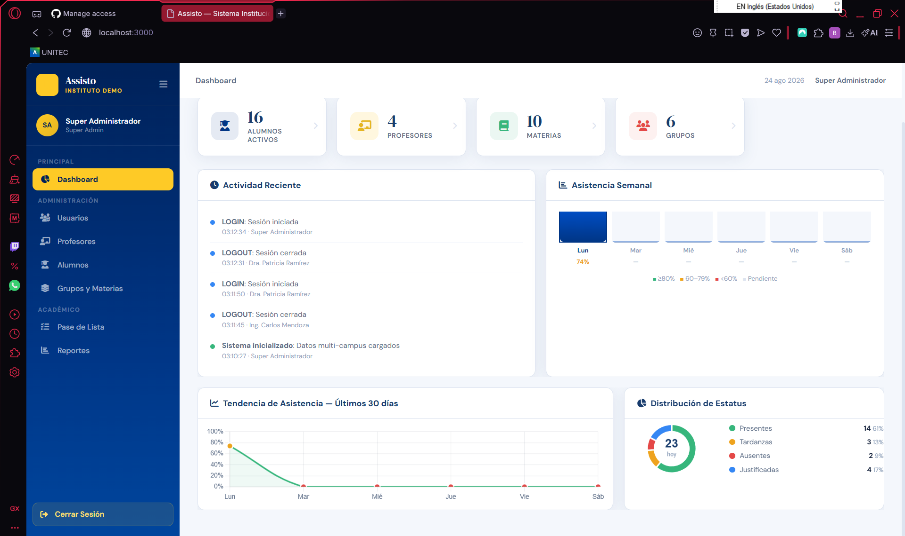
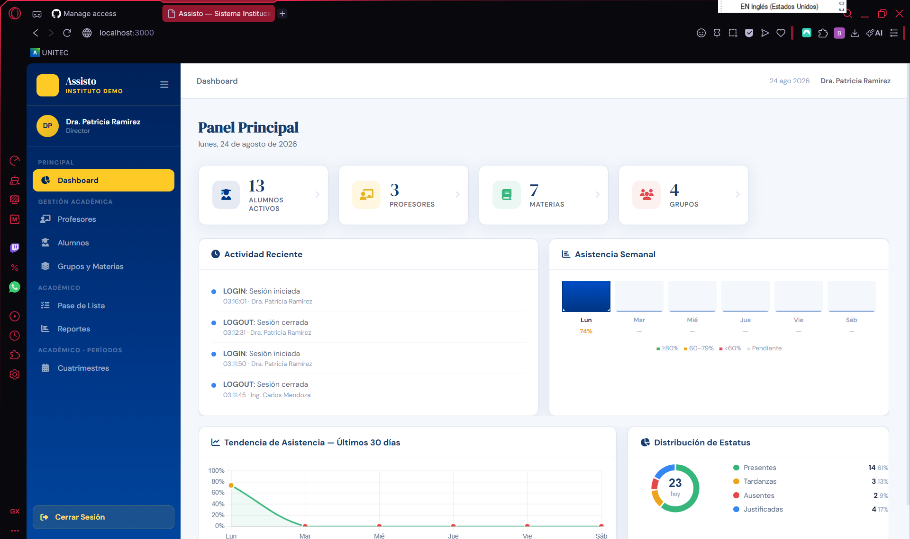
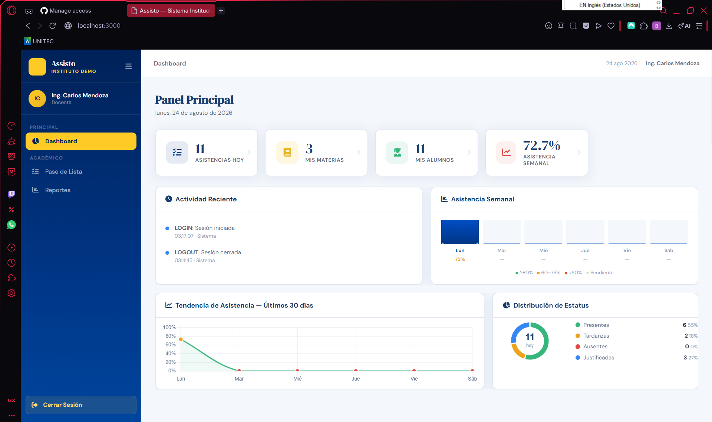
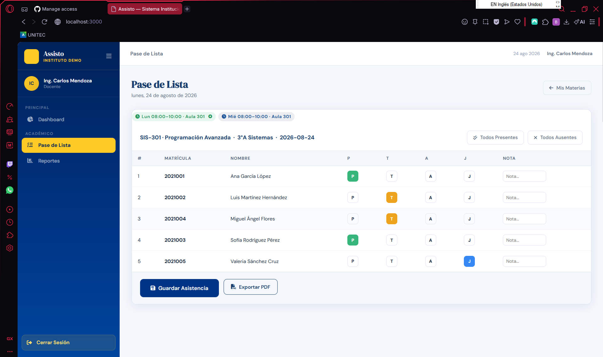
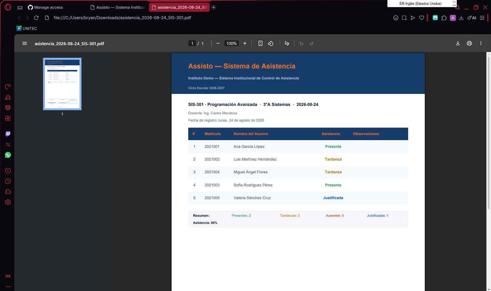

# Assisto

**Sistema institucional de control de asistencia escolar, multi-campus y multi-rol.**

[Español](#español) · [English](#english)



---

## Español

### El problema

En muchas instituciones el pase de lista sigue siendo papel: el docente marca asistencias a mano, las concentra en una hoja de cálculo al final del mes y el reporte para dirección se arma copiando datos entre archivos. El proceso es lento, se pierde información y no hay forma de ver el estado de asistencia en tiempo real.

Assisto digitaliza ese flujo completo: el docente pasa lista desde el navegador en segundos, los datos quedan en una sola base, y dirección obtiene reportes por materia, grupo y periodo sin pedirle nada a nadie.

### Qué hace

- **Pase de lista** con cuatro estatus (Presente, Tardanza, Ausencia, Justificada), notas por alumno y acciones masivas para marcar el grupo completo.
- **Reportes de asistencia** filtrables por materia, grupo y rango de fechas, con exportación a PDF.
- **Gestión académica**: alumnos, profesores, grupos, materias, horarios y cuatrimestres.
- **Importación masiva** de alumnos desde CSV y asignación en lote a grupos y materias.
- **Dashboard con visualizaciones**: tendencia de asistencia a 30 días, distribución por estatus y actividad reciente del sistema.
- **Bitácora de actividad** que registra accesos y operaciones sobre los datos.

### Control de acceso en tres niveles

El sistema no solo autentica: filtra los datos y la interfaz según el rol de quien inicia sesión. La misma pantalla muestra información distinta para cada usuario.

| | Superadmin | Director | Docente |
|---|---|---|---|
| Alcance | Todos los campus | Su campus asignado | Sus materias y grupos |
| Alumnos visibles | 16 | 13 | 11 |
| Materias visibles | 10 | 7 | 3 |
| Secciones del menú | 7 | 6 | 3 |
| Gestión de usuarios | Sí | No | No |

<table>
<tr>
<td width="33%"><br><sub><b>Superadmin</b> — visión global de los cuatro campus.</sub></td>
<td width="33%"><br><sub><b>Director</b> — el sistema filtra automáticamente a su campus.</sub></td>
<td width="33%"><br><sub><b>Docente</b> — indicadores propios: sus materias, sus alumnos.</sub></td>
</tr>
</table>

La restricción se aplica en el servidor, en las consultas SQL, no solo ocultando botones en el front. Un docente que llamara directamente a la API seguiría viendo únicamente los datos de los grupos donde imparte clase.

### Pase de lista y reportes



Cada materia puede tener varios bloques de horario; el sistema los muestra como pestañas y precarga el grupo correspondiente. Al guardar, la asistencia queda disponible de inmediato en los reportes y en el dashboard.



### Stack técnico

| Capa | Tecnología |
|---|---|
| Backend | Node.js · Express |
| Base de datos | SQLite (`better-sqlite3`) |
| Autenticación | JWT (`jsonwebtoken`) · hash de contraseñas con `bcryptjs` |
| Frontend | JavaScript sin framework (SPA) · Chart.js · jsPDF |
| Configuración | Variables de entorno con `dotenv` |

**Por qué SQLite y no PostgreSQL:** el sistema fue pensado para correr en un servidor local dentro de la propia institución, sin infraestructura adicional ni administrador de base de datos. SQLite es un solo archivo, no requiere servicio aparte y soporta sin problema la carga de un plantel. Si el proyecto creciera a operación multi-institucional concurrente, migrar a PostgreSQL sería el siguiente paso.

**Por qué JavaScript sin framework:** el alcance no justificaba el peso de React ni un paso de compilación. Todo el frontend son archivos estáticos que Express sirve directamente, lo que mantiene el despliegue en dos comandos.

### Modelo de datos

14 tablas relacionadas, entre ellas `campus`, `usuarios`, `profesores`, `alumnos`, `grupos`, `materias`, `horarios_materia`, `asistencias` y `actividad_log`. El esquema se crea automáticamente al primer arranque, junto con datos de demostración.

`database.js` incluye además migraciones ligeras: al iniciar verifica si faltan columnas o tablas introducidas en versiones posteriores y las agrega sin destruir la información existente.

### Instalación

Requiere **Node.js 20 o superior**.

```bash
git clone https://github.com/bryan0902/assisto.git
cd assisto
npm install
```

Crea el archivo `.env` a partir del ejemplo y define la llave de firma de tokens:

```bash
cp .env.example .env
```

```
JWT_SECRET=una_cadena_larga_y_aleatoria
```

Arranca el servidor:

```bash
npm start
```

Abre `http://localhost:3000`. La base de datos se crea sola en el primer arranque, con datos de demostración cargados.

### Credenciales de demostración

Todos los datos son ficticios y se generan automáticamente.

| Usuario | Contraseña | Rol |
|---|---|---|
| `superadmin` | `admin123` | Superadministrador |
| `director1` | `dir123` | Director · Campus Norte |
| `director2` | `dir456` | Director · Campus Centro |
| `docente1` | `doc123` | Docente |

### Decisiones de seguridad

- Las contraseñas se almacenan con hash `bcrypt` (10 rondas). En ningún punto se guardan en texto plano.
- La llave de firma de los tokens vive en variables de entorno, fuera del código. El servidor se niega a arrancar si no está definida.
- Los tokens expiran a las 12 horas.
- La autorización se resuelve en un middleware que recibe la lista de roles permitidos por endpoint, y las consultas se filtran por campus o por docente según corresponda.

### Limitaciones conocidas

Vale la pena ser explícito sobre lo que falta:

- **Dependencias sin versión fija.** El `package.json` declara `"*"` en varios paquetes; hoy el `package-lock.json` es lo que garantiza reproducibilidad. Deberían fijarse rangos explícitos.
- **Dos `CREATE TABLE` fuera de lugar.** La tabla `alumno_materia` se crea dentro de endpoints en lugar del archivo de esquema. Funciona, pero no es donde corresponde.
- **Sin paginación.** Los listados traen todos los registros; con varios miles de alumnos habría que paginar del lado del servidor.
- **Sin pruebas automatizadas.** La validación fue manual.
- **Concurrencia limitada.** SQLite en modo WAL soporta bien la escala de un plantel, pero no operación simultánea intensiva.

### Créditos

Proyecto desarrollado para la asignatura de **Arquitectura de la Información** de la licenciatura en Ingeniería en Sistemas Computacionales.

- [Bryan](https://github.com/bryan0902)
- [Mariana Olvera](https://github.com/marianaolveralopez7-art)

Los nombres de institución, campus, personas y direcciones que aparecen en los datos de demostración son ficticios.

---

## English

### The problem

At many institutions, taking attendance is still done on paper: teachers mark students by hand, consolidate the sheets into a spreadsheet at month's end, and build the report for administration by copying data between files. The process is slow, information gets lost, and there is no way to see attendance status in real time.

Assisto digitises that entire flow: teachers take attendance from the browser in seconds, the data lands in a single database, and administrators pull reports by subject, group and period on their own.

### Features

- **Attendance taking** with four statuses (Present, Late, Absent, Excused), per-student notes, and bulk actions for the whole group.
- **Attendance reports** filterable by subject, group and date range, with PDF export.
- **Academic management**: students, teachers, groups, subjects, schedules and academic terms.
- **Bulk import** of students from CSV, plus batch assignment to groups and subjects.
- **Dashboard with charts**: 30-day attendance trend, status distribution, and recent system activity.
- **Activity log** recording sign-ins and data operations.

### Three-tier access control

The system does more than authenticate — it filters both data and interface based on the signed-in user's role. The same screen shows different information to different users.

| | Superadmin | Director | Teacher |
|---|---|---|---|
| Scope | All campuses | Assigned campus | Own subjects and groups |
| Visible students | 16 | 13 | 11 |
| Visible subjects | 10 | 7 | 3 |
| Menu sections | 7 | 6 | 3 |
| User management | Yes | No | No |

Restrictions are enforced server-side, inside the SQL queries — not merely by hiding buttons in the frontend. A teacher calling the API directly would still see only the data for groups they teach.

### Tech stack

| Layer | Technology |
|---|---|
| Backend | Node.js · Express |
| Database | SQLite (`better-sqlite3`) |
| Authentication | JWT (`jsonwebtoken`) · password hashing via `bcryptjs` |
| Frontend | Vanilla JavaScript (SPA) · Chart.js · jsPDF |
| Configuration | Environment variables via `dotenv` |

**Why SQLite over PostgreSQL:** the system was designed to run on a local server inside the institution itself, with no extra infrastructure or database administrator. SQLite is a single file, needs no separate service, and comfortably handles a single campus's load. Scaling to concurrent multi-institution operation would make PostgreSQL the next step.

**Why vanilla JavaScript:** the scope did not justify React's overhead or a build step. The entire frontend consists of static files served directly by Express, which keeps deployment down to two commands.

### Data model

14 related tables, including `campus`, `usuarios`, `profesores`, `alumnos`, `grupos`, `materias`, `horarios_materia`, `asistencias` and `actividad_log`. The schema is created automatically on first run, along with demo data.

`database.js` also performs lightweight migrations: on startup it checks for columns or tables introduced in later versions and adds them without destroying existing data.

### Setup

Requires **Node.js 20 or later**.

```bash
git clone https://github.com/bryan0902/assisto.git
cd assisto
npm install
```

Create your `.env` from the example and set the token signing key:

```bash
cp .env.example .env
```

```
JWT_SECRET=a_long_random_string
```

Start the server:

```bash
npm start
```

Open `http://localhost:3000`. The database is created on first run, pre-loaded with demo data.

### Demo credentials

All data is fictional and generated automatically.

| Username | Password | Role |
|---|---|---|
| `superadmin` | `admin123` | Superadmin |
| `director1` | `dir123` | Director · North Campus |
| `director2` | `dir456` | Director · Central Campus |
| `docente1` | `doc123` | Teacher |

### Security decisions

- Passwords are stored as `bcrypt` hashes (10 rounds), never in plain text.
- The token signing key lives in environment variables, outside the codebase. The server refuses to start if it is undefined.
- Tokens expire after 12 hours.
- Authorisation is handled by a middleware that receives the list of roles allowed per endpoint, with queries scoped by campus or teacher as appropriate.

### Known limitations

Worth being explicit about what's missing:

- **Unpinned dependencies.** `package.json` declares `"*"` for several packages; reproducibility currently rests on `package-lock.json` alone. Explicit ranges should be pinned.
- **Two misplaced `CREATE TABLE` calls.** The `alumno_materia` table is created inside endpoints rather than in the schema file. It works, but it doesn't belong there.
- **No pagination.** Listings return every record; several thousand students would require server-side pagination.
- **No automated tests.** Validation was manual.
- **Limited concurrency.** SQLite in WAL mode handles a single campus well, but not heavy simultaneous operation.

### Credits

Built for the **Information Architecture** course of the Computer Systems Engineering degree.

- [Bryan](https://github.com/bryan0902)
- [Mariana Olvera](https://github.com/marianaolveralopez7-art)

Institution, campus, people and address names appearing in the demo data are fictional.
